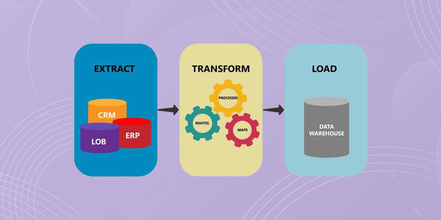

# Remote Work and Travel 
## Extract-Transform-Load

## Overview 

Day to day life was severely interrupted almost two years ago due to the impact of covid-19. Including in person work environments. In this collaborative project, creators analyzed the recent growth in remote work and its relation to travel post covid-19. 

## Analysis 

Jupyter notebook as well as pandas and matplotlib were used in this analysis to answer the following questions: 

1. What age groups were surveyed to collect this data and what conclusions can we draw from the different age groups based on their responses?

2. What type of occupations were surveyed for this data and were there any uncovered trends based on this factor?

3. How did travel have an effect on the United States and can a relationship between travel and remote work be determined?

### ETL 

<strong>EXTRACT</strong>

The following sources were utlized to extract data:

Kaggle-Remote Working Survey-https://www.kaggle.com/datasets/melodyyiphoiching/remote-working-survey
Kaggle-Predict if people prefer WFH vs WFO post Covid-19-https://www.kaggle.com/datasets/anninasimon/predict-if-people-prefer-wfh-verses-wfo-data?resource=download&select=WFH_WFO_dataset.csv
Bureau of Transportation Statistics- https://www.bts.gov/covid-19

<strong>TRANSFORM</strong>

The data sources were transformed into dataframes that were cleaned to only show the most important data within the datasets. The 'Remote Working Survey' and 'Predict if people prefer WFH vs WFO pos Covid-19' datasets were joined to allow ease of visualization. 

The Bureau of Transportation and Statistics dataset was kept seperate to allow the user to draw their own conclusions related to the data. Due to this dataset providing the actual amount of people who worked from home vs work in the office, pre and post COVID-19.  

<strong>LOAD</strong>
The transformed data was loaded into PostgreSQL, a relational database. 

## Observations and Inferences

insert visuals and draw inferences from the data 

## Conclusion 

Describe the structure of the final database along with any improvements that could be made in the future 

succinct description of the findings

